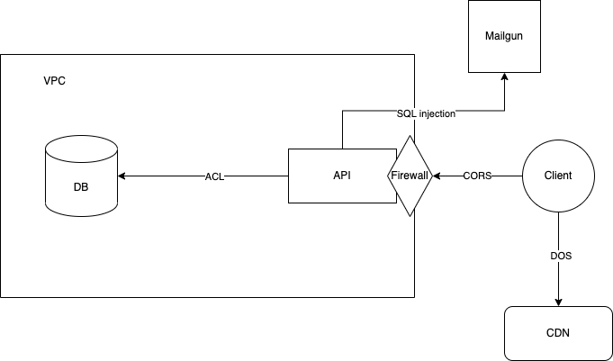

# Threat model SecureCityTravel

## **Threat Model Information**

**Application Version:** 1.0

**Description:** The SecureCityTravel API allows users to retrieve lists of curated and ranked restaurants, bars and activities for a city trip to Berlin. As this is the first implementation of the website, the functionality will be limited. There will be two types of users in the application:

1. Users
2. Admin

Admin and users will be able to log in, reset their password and request lists. Only admin members can change lists.

**Document Owner:** Paula Dettmann

# External Dependencies

| ID | Description | Extra information | Source |
| --- | --- | --- | --- |
| 1 | The SecureCityTravel API will be running on a NodeJS server hosted on a DigitalOcean Droplet. | DigitalOcean Droplets are Linux-based virtual machines (VMs) that run on top of virtualized hardware | [https://docs.digitalocean.com/products/droplets/quickstart/](https://docs.digitalocean.com/products/droplets/quickstart/) |
| 2 | The database engine will be MongoDB which will be hosted on DigitalOcean in a VPC network. | A Virtual Private Cloud (VPC) is a private network interface for collections of DigitalOcean resources. VPC networks provide a more secure connection between resources because the network is inaccessible from the public internet and other VPC networks. | [https://docs.digitalocean.com/products/networking/vpc/](https://docs.digitalocean.com/products/networking/vpc/) |
| 3 | The web server is behind a cloud firewall and the only communication available is TLS. | DigitalOcean Cloud Firewalls are a network-based, stateful firewall service for Droplets provided at no additional cost. Cloud firewalls block all traffic that isn't expressly permitted by a rule. | [https://docs.digitalocean.com/products/networking/firewalls/](https://docs.digitalocean.com/products/networking/firewalls/) |
| 4 | Mailgun is an email sending API with SMTP relay and flexible HTTP |  |  |

# STRIDE

A threat categorization such as STRIDE is useful in the identification of threats by classifying attacker goals such as:

- **S**poofing
- **T**ampering
- **R**epudiation
- **I**nformation Disclosure
- **D**enial of Service
- **E**levation of Privilege

A list of generic threats classified using STRIDE is provided in the following table along with their countermeasures:

# STRIDE Threat List

| Type | Description | Countermeasure |
| --- | --- | --- |
| Spoofing | Threat action aimed at accessing and use of another user's credentials, such as username and password. | 1. Appropriate authentication, 2. Protect secret data, 3. Don't store secrets |
| Tampering | Threat action intending to maliciously change or modify persistent data, such as records in a database, and the alteration of data in transit between two computers over an open network, such as the Internet. | 1. Authentication,2. Authorisation,3. Configured IP access on the DB,4. ORM (Mongoose has: built-in type casting, validation and  query building) |
| Repudiation| Threat action aimed at performing prohibited operations in a system that lacks the ability to trace the operations. | 1. Non-Repudiation in the form of Status and receipt, 2. Timestamps |
| Information disclosure | Threat action intending to read a file that one was not granted access to, or to read data in transit. | 1. Authorisation, 2. TLS, 3. Encryption, 4. Protected secrets |
| Denial of service | Threat action attempting to deny access to valid users, such as by making a web server temporarily unavailable or unusable. | 1. DigitalOcean is equipped against DoS attacks on the DB, 2. CloudFlare provides DoS protection for the API, 3. Authentication and Authorisation |
| Elevation of privilege | Threat action intending to gain privileged access to resources in order to gain unauthorized access to information or to compromise a system. | Run with least privilege |

# Application Security Frame (ASF) Threat & Countermeasures

| Threat Type | Countermeasure |
| --- | --- |
| Authentication | 1. Credentials and authentication tokens are protected with encryption in storage and transit, 2. Passwords are stored with salted hashes, 3. Password resets do not reveal password hints and valid usernames |
| Authorization | 1. Strong ACLs are used for enforcing authorized access to resources, 2. Scope-based access controls are used to restrict access to specific operations, 3. The system follows the principle of least privilege for user and service accounts |
| Configuration Management | 1. Least privileged processes are used and service accounts with no administration capability, 2. Access to configuration files and administrator interfaces is restricted to administrators |
| Data Protection in Storage and Transit | 1. Standard encryption algorithms and correct key sizes are being used, 2. Secrets (e.g. keys, confidential data ) are cryptographically protected both in transport and in storage, 3. Built-in secure storage is used for protecting keys, 4. No credentials and sensitive data are sent in clear text over the wire |
| Data Validation / Parameter Validation | 1. Data type, format, length, and range checks will be enforced, 2. All data sent from the client will be validated |
| Error Handling and Exception Management | 1. All exceptions are handled in a structured manner, 2. Error messages will be scrubbed so that no sensitive information is revealed to the attacker |
| Auditing and Logging | 1. Sensitive information (e.g. passwords) is not logged, 2. Log files will provide an audit trail for sensitive operations and logging of key events |

### High-level diagram

### List of cyber security measures

- Passwords (hashed and salted)
- JWT tokens (signed to prevent unauthorised access)
- User scopes (admin and user)
- Secure password reset
- Secrets stored outside of the project
- CORS
- Canary accounts in the database
- Validation is separated from core business logic through middleware
- Firewall
- VPC (Virtual Private Cloud)
- ACL (Access-Control-List)
